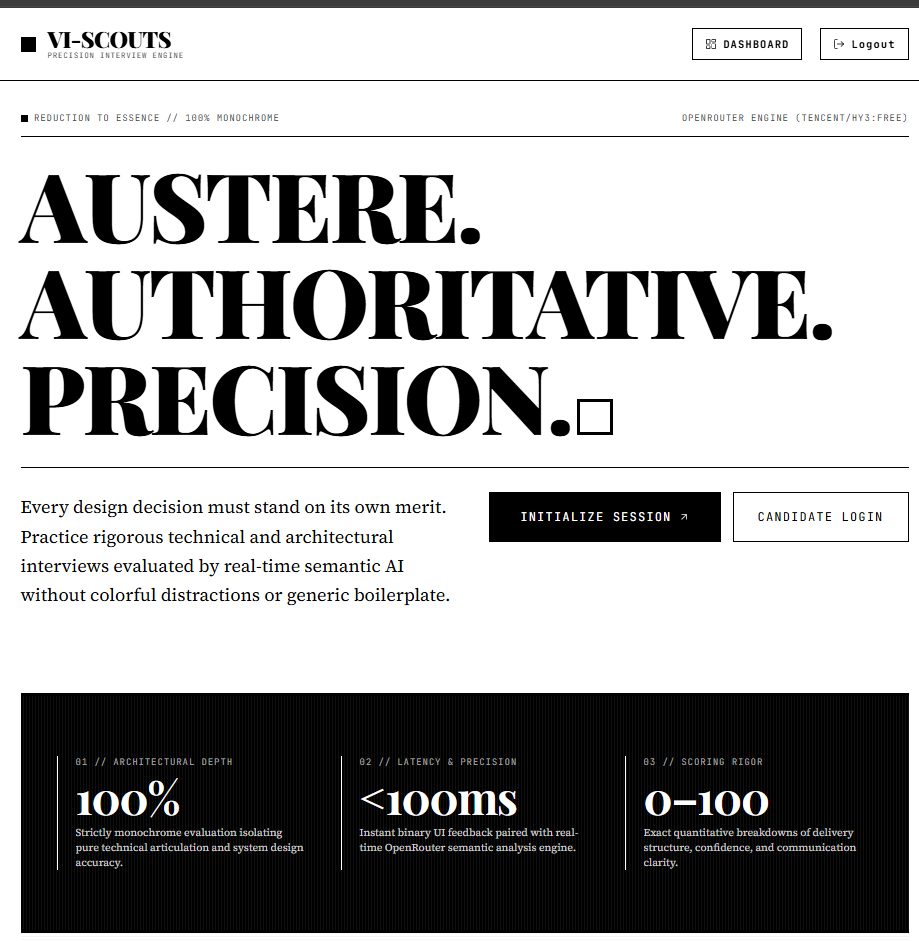

# 🧠 VI-SCOUTS | Next-Gen AI Candidate Assessment Platform

<p align="center">
  
</p>

<p align="center">
  <strong>Practice realistic technical, behavioral, and architectural interviews with real-time AI semantic feedback and precision scoring.</strong>
</p>

---

## ✨ Overview

**VI-SCOUTS** is an enterprise-grade, dynamic AI interview practice suite designed with an **Austere. Authoritative. Precision Editorial Monochrome** aesthetic. It enables candidates to test their skills across demanding technical trade-offs, STAR-method leadership questions, and rapid quick-fire scenarios while receiving instant clarity and confidence analytics.

### 🔥 Key Features
- **🎨 Precision Monochrome Editorial UI/UX**: Built with sharp monochrome borders, high-contrast dark/light typography, ambient glowing accents, smooth framer-motion micro-animations, and crystal-clear presentation.
- **📄 AI Resume Parsing (.PDF Upload)**: Upload your PDF resume to dynamically extract core technical competencies, calculate a tailored readiness profile (`0–100%`), and generate custom interview questions.
- **📊 Interactive Performance Trajectory Analytics**: Real-time interactive charts visualizing your confidence and communication score trajectories across questions.
- **🤖 Real-Time Semantic Evaluation Engine**: Deep domain-aware AI scoring using **Google Gemini** (with smart local fallback heuristics) to evaluate structural articulation and technical clarity.
- **⚡ One-Click Demo Credentials**: Test the platform instantly without friction using pre-configured candidate accounts (`demo@vi-scouts.com`).
- **☁️ 24/7 Cloud & Vercel Serverless Deployment**: Configured with `@vercel/python` and `@vercel/static-build` (`vercel.json`) for effortless, instant fullstack cloud hosting on **Vercel**.

---

## 🛠️ Technology Stack

- **Frontend**: React 18, Vite, Tailwind CSS, Framer Motion, Lucide Icons
- **Backend**: Python 3.11+, FastAPI, Uvicorn, SQLite, Google Gemini AI (`google-genai` SDK)

---

## 🚀 Quick Setup & Installation

### Prerequisites
- **Node.js** 18+ & **npm**
- **Python** 3.10+ (recommended 3.11+)

### 1️⃣ Backend Setup
1. Open a terminal and navigate to the `backend/` directory:
   ```powershell
   cd backend
   ```
2. Create and activate a Python virtual environment:
   ```powershell
   python -m venv venv
   .\venv\Scripts\Activate
   ```
3. Install dependencies:
   ```powershell
   pip install -r requirements.txt
   ```
4. Configure environment variables:
   ```powershell
   copy .env.example .env
   ```
   *(Optional: Edit `.env` and insert your `GOOGLE_API_KEY` to enable live Google Gemini evaluations).*

5. Start the backend API server:
   ```powershell
   python -m uvicorn main:app --reload --host 0.0.0.0 --port 8000
   ```

---

### 2️⃣ Frontend Setup
1. Open a new terminal and navigate to the `frontend/` directory:
   ```powershell
   cd frontend
   ```
2. Install dependencies:
   ```powershell
   npm install
   ```
3. Launch the development server:
   ```powershell
   npm run dev
   ```

4. Open your browser and visit: **`http://localhost:5173/`**

---

## 💡 Demo Login Credentials
To test the platform immediately after starting the servers, click **"Login with Demo ID"** on the landing page or use:
- **Email**: `demo@vi-scouts.com`
- **Password**: `password123`

---

## 📄 License
© 2026 VI-SCOUTS Platform. All rights reserved.
